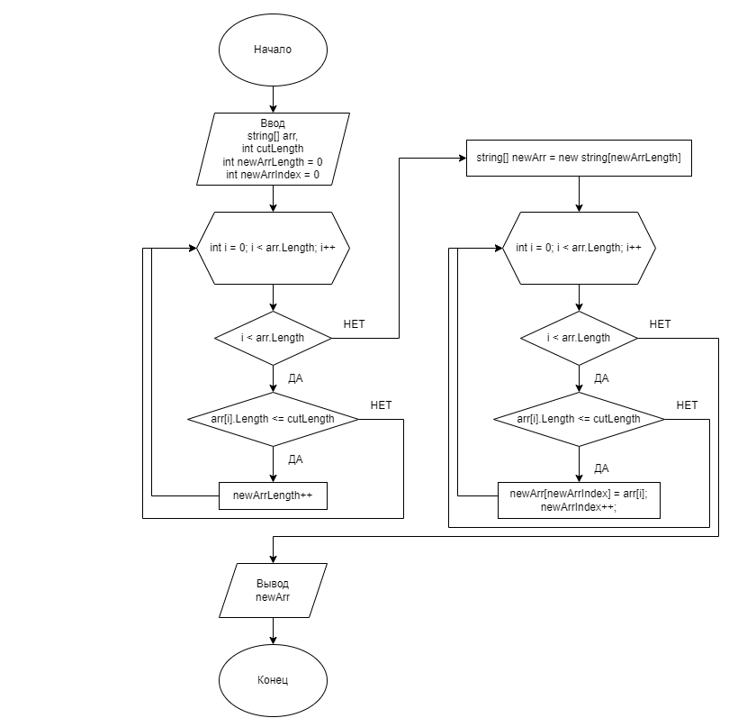

# Итоговая работа
Задача алгоритмически не самая сложная, однако для полноценного выполнения проверочной работы необходимо:

1. Создать репозиторий на GitHub
2. Нарисовать блок-схему алгоритма (можно обойтись блок-схемой основной содержательной части, если вы выделяете её в отдельный метод)
3. Снабдить репозиторий оформленным текстовым описанием решения (файл README.md)
4. Написать программу, решающую поставленную задачу
5. Использовать контроль версий в работе над этим небольшим проектом (не должно быть так, что всё залито одним коммитом, как минимум этапы 2, 3, и 4 должны быть расположены в разных коммитах)

Задача: Написать программу, которая из имеющегося массива строк формирует новый массив из строк, длина которых меньше, либо равна 3 символам. Первоначальный массив можно ввести с клавиатуры, либо задать на старте выполнения алгоритма. При решении не рекомендуется пользоваться коллекциями, лучше обойтись исключительно массивами.

Примеры:
[“Hello”, “2”, “world”, “:-)”] → [“2”, “:-)”]
[“1234”, “1567”, “-2”, “computer science”] → [“-2”]
[“Russia”, “Denmark”, “Kazan”] → []

# Блок-схема алгоритма

# Описание решения
1. Создаем метод, кторый на входе имеет массив для обрезки и длину символов которым будет произведена обрезка массива.
2. Определяем длинну выходного массива первым циклом.
3. Вторым циклом добавляем в массив элементы из входного массива по условию задачи.
4. Вывод массива.
5. Печать массива.

# Программа решения задачи

string[] a = new string[] { "hello", "2", "world", ":-)" };
string[] b = new string[] { "1234", "1567", "-2", "computer science" };
string[] c = new string[] { "Russia", "Denmark", "Kazan" };

void PrintArray(string[] arr)
{
    Console.Write("[");
    for (int i = 0; i < arr.Length; i++)
    {
        if (i < arr.Length - 1) Console.Write(arr[i] + ",");
        else Console.Write(arr[i]);
    }
    Console.WriteLine("]");
}

string[] StringLengthLessCutLength(string[] arr, int cutLength)
{
    int newArrLength = 0;
    for (int i = 0; i < arr.Length; i++)
    {

        if (arr[i].Length <= cutLength)
        {
            newArrLength++;
        }
    }

    string[] newArr = new string[newArrLength];
    int newArrIndex = 0;
    for (int i = 0; i < arr.Length; i++)
    {
        if (arr[i].Length <= cutLength)
        {
            newArr[newArrIndex] = arr[i];
            newArrIndex++;
        }
    }
    return newArr;
}

PrintArray(StringLengthLessCutLength(a, 3));
PrintArray(StringLengthLessCutLength(b, 3));
PrintArray(StringLengthLessCutLength(c, 3));